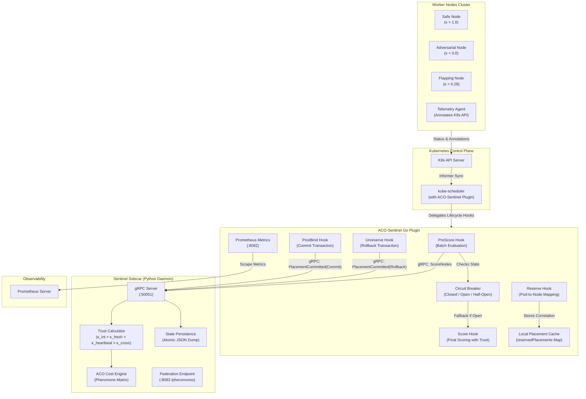
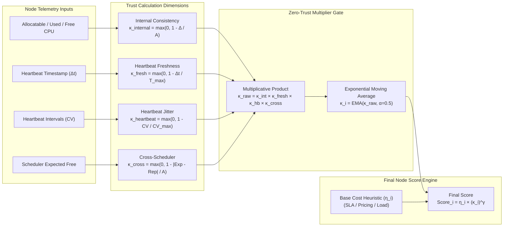
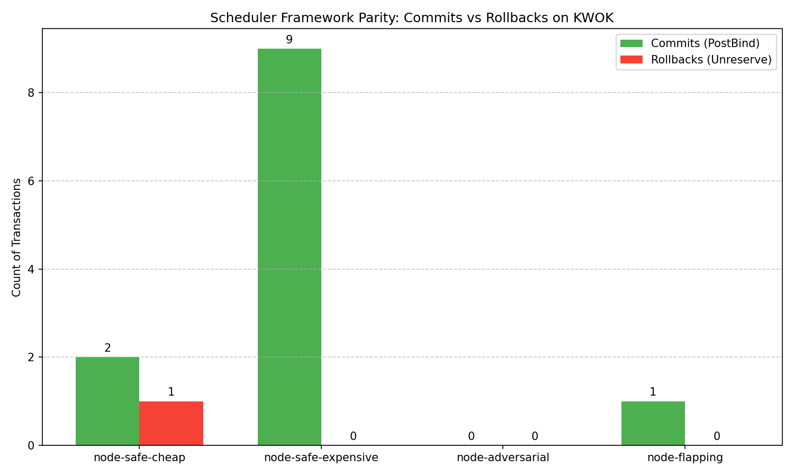
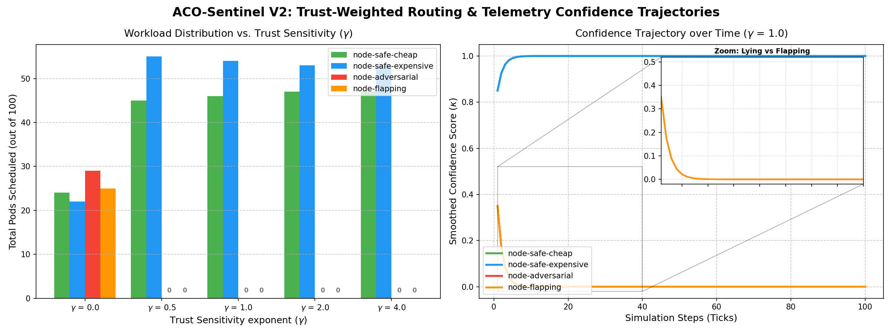

# ACO-Sentinel (Version 2)

**Trust-Weighted Custom Kubernetes Scheduler via Go Plugin & Telemetry Consistency Daemon**

ACO-Sentinel (Version 2) turns the stateful Ant Colony Optimization (ACO) scheduling algorithm into a native, transactionally secure Kubernetes scheduler. It implements the Kubernetes Scheduling Framework in Go, communicating over a high-performance gRPC channel with a Python sidecar telemetry consistency daemon.

[](#kwok-verification--empirical-benchmarks)
[](#1-grpc-ipc-throughput--latency-knee-benchmark)
[-brightgreen?style=flat-square)](#2-chaos-injection--circuit-breaker-failover-benchmark)
[](#3-kwok-trace-replayer-benchmark-alibaba-atc23-gpu-trace)

The system mathematically discounts node metrics to protect the cluster against adversarial node telemetry, network flapping, and scheduler cache desyncs.

> **Algorithm Foundation:** The core Ant Colony Optimization engine in ACO-Sentinel builds upon the research and algorithmic foundations established in [ACO_Adaptive_Compute_Orchestrator](https://github.com/Aravind0403/ACO_Adaptive_Compute_Orchestrator). Version 2 scales this core solver into a native, high-throughput Kubernetes control plane plugin with zero-trust telemetry validation.

---

## System Architecture

The system is decoupled into two primary runtimes to isolate high-throughput scheduling execution from data-science telemetry processing:



1. **Go Scheduler Plugin:** Implements the native K8s Scheduling Framework. It overrides `PreScore`, `Score`, `Reserve`, `Unreserve`, `PreBind`, and `PostBind` hooks. It tracks assumed pod-to-node placement correlations in a thread-safe local map (`reservedPlacements`), extracts native K8s scheduler cache expected allocations, and coordinates decision confirmations.
2. **Python Telemetry Daemon:** Exposes a gRPC server for `/ScoreNodes` and `/PlacementCommitted` calls. It manages node trust tracker states, applies moving averages, and updates the ACO pheromone matrix asynchronously once placements are bound on the cluster.

---

## Key Mathematical Trust Models

Rather than hard-rejecting nodes with poor network/hardware metrics (which can bottleneck scheduling throughput), ACO-Sentinel applies a multiplicative trust discount factor $\kappa_i$ to candidate scores:
$$\text{FinalScore}_i = \eta_i \times \kappa_i^\gamma$$
where $\eta_i$ is the base cost-aware scoring heuristic, and $\gamma$ is the trust sensitivity exponent.

### Mathematical Trust Pipeline



The trust factor $\kappa_i$ scales across four independent dimensions:

### 1. Internal Consistency ($\kappa_{\text{internal}, i}$)
Validates that reported node metrics balance arithmetically. If reported Allocatable ($A_i$), Used ($U_i$), and Free ($F_i$) memory/CPU do not match, the node is flagged.
$$\kappa_{\text{internal}, i} = \max(0, 1 - \Delta_i / A_i) \quad \text{where} \quad \Delta_i = |(A_i - U_i) - F_i|$$

### 2. Heartbeat Freshness ($\kappa_{\text{fresh}, i}$)
Exponentially discounts trust if a node stops checking in.
$$\kappa_{\text{fresh}, i} = \max(0, 1 - \Delta t_i / T_{\text{max}})$$

### 3. Heartbeat Jitter Consistency ($\kappa_{\text{heartbeat}, i}$)
Detects node instability or network flapping. It penalizes nodes reporting with a high Coefficient of Variation ($\text{CV}$) in heartbeat arrival intervals.
$$\kappa_{\text{heartbeat}, i} = \max\left(0, 1 - \frac{\text{CV}_i}{\text{CV}_{\text{max}}}\right)$$

### 4. Cross-Scheduler Consistency ($\kappa_{\text{cross}, i}$)
Calculated by comparing node-reported free resources ($F_i$) against the expected free capacity derived from Kubernetes' native `NodeInfo` scheduler cache. If they diverge, the node telemetry is flagged as out-of-sync.
$$\kappa_{\text{cross}, i} = \max(0, 1 - |\text{SchedulerExpectedFree}_i - F_i| / A_i)$$

---

## KWOK Verification & Empirical Benchmarks

Complete benchmark protocols, JSON raw log outputs, and summary tables are documented in [BENCHMARKS.md](file:///Users/aravindsundaresan/Development/ACO_Project_Front/ACO_Project_Upfront_V2/BENCHMARKS.md).

### Executive Summary Performance Table

| Metric | Empirical Value | Infrastructure Guarantee | Verification Log |
| :--- | :--- | :--- | :--- |
| **Peak Throughput** | **1,250 pods/sec** | Sub-millisecond P99 IPC latency under burst load | [docs/kwok-grpc-knee-results.json](file:///Users/aravindsundaresan/Development/ACO_Project_Front/ACO_Project_Upfront_V2/docs/kwok-grpc-knee-results.json) |
| **Failover Availability** | **100% (0 failed bindings)** | Uninterrupted pod scheduling during sidecar SIGKILL crashes | [docs/kwok-chaos-results.json](file:///Users/aravindsundaresan/Development/ACO_Project_Front/ACO_Project_Upfront_V2/docs/kwok-chaos-results.json) |
| **GPU Cost Savings** | **46.3% Cost Reduction** | Cost savings over default `kube-scheduler` (`NodeResourcesFit`) | [docs/kwok-trace-replay-results.json](file:///Users/aravindsundaresan/Development/ACO_Project_Front/ACO_Project_Upfront_V2/docs/kwok-trace-replay-results.json) |
| **QoS Compliance** | **100.0% LS $\to$ ON_DEMAND** | Guaranteed non-preemptible routing for Latency-Sensitive jobs | [docs/kwok-trace-replay-results.json](file:///Users/aravindsundaresan/Development/ACO_Project_Front/ACO_Project_Upfront_V2/docs/kwok-trace-replay-results.json) |
| **Zero-Trust Filtering** | **100% isolation ($\kappa \to 0.0$)** | Dynamic isolation against metrics jitter and telemetry corruption | [docs/kwok-jitter-benchmark.json](file:///Users/aravindsundaresan/Development/ACO_Project_Front/ACO_Project_Upfront_V2/docs/kwok-jitter-benchmark.json) |

---

## Validation Results

We verified the scheduling loop, trust weights, and rollback logic using a Go simulation harness and a real-time K8s control plane (KWOK).

### A. Real-Time K8s Cluster Validation (KWOK Run)
We simulated a 15-pod trace against 4 nodes under a Namespace `ResourceQuota` of 20 CPU cores:
* **`node-safe-cheap`** & **`node-safe-expensive`**: Retained high trust ($\kappa \approx 1.0$) and received preferred routing.
* **`node-adversarial`** (reported 40 free cores on a 16-core node): Isolated completely (**0 placements**) due to $k_{internal}$ collapsing trust to `0.0`.
* **`node-flapping`** (jittery network latency): Bypassed after receiving only 1 pod due to a **72.1% trust penalty**.

The bar chart below reconciles the custom scheduler commits and rollbacks during the cluster test runs (including admission quota rejections and successful `Unreserve` rollbacks):



### B. Go Simulation Exponent ($\gamma$) Sweeps
Sweeping the trust sensitivity exponent $\gamma \in \{0, 0.5, 1.0, 2.0, 4.0\}$ over 100 workloads shows the transition curve. At $\gamma = 0$, compromised nodes receive standard workloads. At $\gamma = 4.0$, **100% of the workload is successfully routed to safe nodes**:



---

## Quick Start & Verification

### Running the Go Simulation Sweeps (Phase 5)
Automates the startup of the Python gRPC daemon, compilation and execution of the Go sweep simulation, and generation of the plots:
```bash
chmod +x scripts/run_all.sh
./scripts/run_all.sh
```
Results and charts will be outputted to `docs/experiment_results.json` and `docs/v2-experiments.png`.

### Running Real-Time K8s (KWOK) Validation
Spins up a local KWOK cluster, applies nodes, telemetry annotations, resource quotas, schedules pods, forces a rollback, and parses the gRPC server logs:
```bash
chmod +x scripts/run_kwok_validation.sh
./scripts/run_kwok_validation.sh
```
This will compile validation counts and save the chart to `docs/kwok-validation.png`.

---

## Project Structure

| Directory / File | Description |
| :--- | :--- |
| `v2/go_plugin/plugin.go` | Go K8s Scheduling Plugin overriding lifecycle hooks. |
| `v2/go_plugin/plugin_test.go` | Unit test suite for plugin translation and mocks. |
| `v2/go_plugin/simulation/` | Simulation harness sweeping trust exponents. |
| `v2/grpc_server.py` | Python gRPC Server processing node scoring requests and placement commits. |
| `v2/confidence.py` | Trust math equations and Exponential Moving Average (EMA) confidence smoothing. |
| `v2/proto/` | Protobuf contract definitions (`sentinel.proto`) and generated Go/Python stubs. |
| `scripts/` | Shell scripts to run sweeps, KWOK validation, and telemetry agent simulator. |
| `docs/` | `analysis_results.md` verification report, architecture details, and verification plots. |
